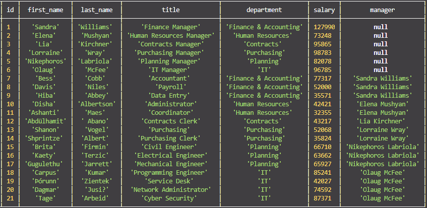

# Employee-Tracker


## Description
For homework assignment 12 I had to create an Employee Tracker application where you can view, add, update and delete entries. This was a very challenging assignment and I put in a lot of hours to make it what it is. The entire app runs dynamically and is very user friendly.

## Table Of Contents
- [Technologies](#Technologies-Used)
- [Installation](#Installation)
- [Usage](#Usage)
- [Screenshots](#Screenshots)
- [Video Walkthrough](#Video-Walkthrough)
- [Questions](#Questions)
- [License](#License)

## Technologies Used
For this CLI application I used Mysql, Node, Inquirer, JavaScript, Console.Table, Asciiart-Logo and Chalk.

## Installation
This application is easy to install, just clone the repository and run the following command in your terminal. You will however need to create a file named password.js. Within the password.js file you will need to create a variable that will hold your password and export the variable for privacy.

```
npm install
```

This will create the node modules folder you will need in order for this application to function correctly.

## Usage
In order to get this application to run you must open up the terminal and enter the following:

```
node node.js
```
You will then be prompted with a series of options to choose from in the following order:

1. View All Employees
2. View All Employees By Department
3. View ALL Employees By Manager
4. View All Employees By Roles
5. View Department Budgets
6. Add Employee
7. Add Department
8. Add Role
9. Update Employee Role
10. Update Employee Manager
11. Delete Employee
12. Delete Role
13. Delete Department
14. Exit

Based on the user selection. The user can view, add, update, delete or exit the application.

## Screenshots



## Video Walkthrough  
Please click **[Here](https://youtu.be/g9tlIpv78nc)** to view a video on the application


## Questions
To view my other repositories or to connect with me on GitHub please click **[Here](https://github.com/HustinKava/)**
If you have any questions please feel free to reach out to me at the following email: *hkavafsd@gmail.com*

## License

